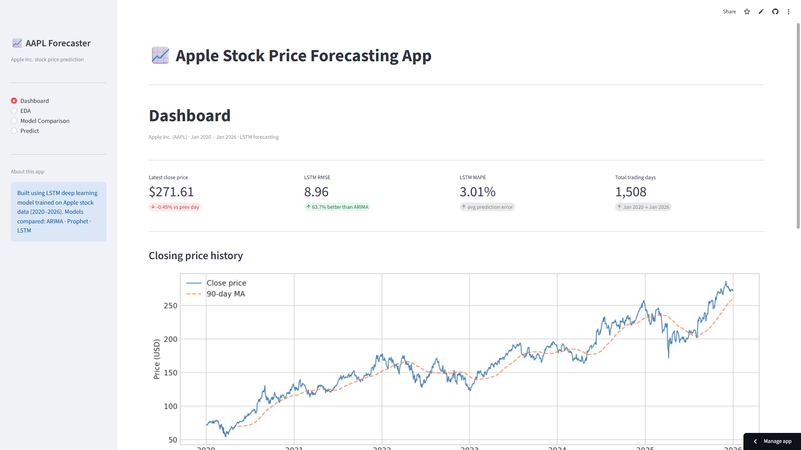

# Apple Stock Price Forecasting
### Time Series Analysis using ARIMA · Prophet · LSTM


---

## Overview

This project is a complete end-to-end time series forecasting pipeline built on Apple Inc. (AAPL) daily stock data from January 2020 to January 2026. The goal is to predict the next day's closing price using historical price data, comparing three different modelling approaches — a classical statistical model, a modern decomposition-based model, and a deep learning model.

The project is deployed as an interactive Streamlit web application where users can explore the data, compare model results, and generate forecasts.

---

## 📸 App Preview




## Live Demo

🔗 [Open the Streamlit App](https://apple-stock-price-forecasting.streamlit.app/) 

---

## Project Structure

```
Apple_Stock/
├── app.py                  ← Streamlit web application
├── notebook.ipynb          ← Complete analysis notebook 
├── lstm_model.h5           ← Pre-trained LSTM model
├── scaler.pkl              ← Fitted MinMaxScaler
├── aapl_data.csv           ← Cleaned AAPL dataset
├── requirements.txt        ← Python dependencies
└── README.md  
└── runtime.txt       
             
```

---

## Dataset

| Property | Value |
|----------|-------|
| Source | Yahoo Finance via `yfinance` |
| Ticker | AAPL (Apple Inc.) |
| Period | January 2020 – January 2026 |
| Rows | 1,508 trading days |
| Features | Close, High, Low, Open, Volume |
| Missing values | None |

---

## Methodology — 6 Phase Pipeline

### Phase 1 · Data Collection & Inspection
- Downloaded 6 years of daily AAPL data using `yfinance`
- Flattened MultiIndex columns, verified shape and data types
- Confirmed zero missing values across all 5 columns

### Phase 2 · Exploratory Data Analysis (EDA)
- Plotted closing price, opening price, daily high and low over time
- Correlation heatmap revealed Open/High/Low/Close are ~0.99 correlated — confirming only `Close` is needed for modelling
- Daily returns computed using `pct_change()` — distribution is roughly bell-shaped with fat tails
- 30-day rolling volatility revealed the COVID-19 volatility spike in March 2020

### Phase 3 · Decomposition & Stationarity Testing
- Multiplicative seasonal decomposition (period = 252 trading days)

| Component | Strength | Interpretation |
|-----------|----------|----------------|
| Trend | **1.00** | Extremely strong upward trend |
| Seasonality | **0.26** | Weak — no meaningful yearly cycle |

- Augmented Dickey-Fuller (ADF) test results:

| Series | p-value | Result |
|--------|---------|--------|
| Raw closing price | ~1.0000 | Non-stationary ✗ |
| First difference | 0.0000 | Stationary ✓ |

### Phase 4 · ARIMA Modelling
- ACF and PACF plots showed classic random walk pattern — no significant lags outside confidence bands
- Manual model: `ARIMA(1,1,0)` — AR term was statistically insignificant (p = 0.438)
- `auto_arima` selected `ARIMA(0,1,0)` as best model — a pure random walk with drift
- Every attempt to add complexity (AR or MA terms) increased AIC — confirming no linear pattern exists

### Phase 5a · Prophet Modelling
- Used Facebook Prophet with weekly and yearly seasonality
- Original model (`changepoint_prior_scale=0.05`) overshot during mid-2025 correction
- Tuned model (`changepoint_prior_scale=0.3`) improved RMSE from 28.69 → 27.34

### Phase 5b · LSTM Modelling
- Architecture: 2-layer stacked LSTM with Dropout regularisation

```
Input  → LSTM(64, return_sequences=True) → Dropout(0.2)
       → LSTM(32)                         → Dropout(0.2)
       → Dense(1)
Total trainable parameters: 29,345
```

- Data preparation: MinMaxScaler → 60-day sliding window sequences → 3D reshape `(samples, 60, 1)`
- Training: EarlyStopping (patience=10) triggered at epoch 20 — clean convergence, no overfitting
- 80/20 train-test split: 1,158 training samples, 290 test samples

### Phase 6 · Findings & Conclusion
See results below and the final notebook section for full write-up.

---

## Results

| Model | RMSE | MAE | MAPE | vs ARIMA |
|-------|------|-----|------|----------|
| ARIMA(0,1,0) | 24.71 | 20.17 | — | baseline |
| Prophet (original) | 28.69 | 22.56 | 10.35% | -16.1% |
| Prophet (tuned) | 27.34 | 21.14 | 9.64% | -10.7% |
| **LSTM** | **8.96** | **6.88** | **3.01%** | **+63.7%** |

**Best model: LSTM** with a MAPE of 3.01% — predicting Apple's closing price within an average of $6.88 on a stock trading around $220–270.

---

## Key Findings

**1. Apple stock follows a random walk**
Auto-ARIMA confirmed that `ARIMA(0,1,0)` — a pure random walk — is the best linear model. No AR or MA term improved performance, validating the Efficient Market Hypothesis for this dataset.

**2. Strong trend, weak seasonality**
Decomposition revealed trend strength of 1.00 and seasonal strength of only 0.26. Apple's price is almost entirely driven by long-term momentum, not yearly cycles.

**3. LSTM significantly outperformed statistical models**
The 60-day memory window allowed LSTM to learn momentum and trend direction that ARIMA and Prophet could not capture with linear or decomposition-based approaches. RMSE improved by 63.7% over the baseline.

**4. Prophet forecast in the right direction but overshot**
Prophet correctly identified the upward trend but was penalised heavily when the actual price corrected downward in mid-2025 while Prophet continued forecasting upward.

---

## Limitations

- **Univariate model** — only closing price is used; news, earnings, and macro events are not considered
- **One-step-ahead prediction** — model uses real historical data for each prediction, not a true multi-step recursive forecast
- **No external signals** — sentiment, interest rates, or sector data are excluded

---

## Future Improvements

- Add technical indicators (RSI, MACD, Bollinger Bands) for multivariate LSTM
- Incorporate trading volume as additional input feature
- Sentiment analysis from financial news headlines
- Experiment with GRU or Transformer architecture
- Walk-forward validation for more robust evaluation

---

## Streamlit App Pages

| Page | Description |
|------|-------------|
| **Dashboard** | Key metrics, price history chart, model comparison table, ADF results |
| **EDA** | Price & MA plots, volume, daily returns, volatility, correlation heatmap, decomposition |
| **Model Comparison** | Side-by-side RMSE/MAE bar charts, insight cards for each model |
| **Predict** | Slider to choose forecast horizon → LSTM generates day-by-day price predictions |

---

## Installation & Running Locally

```bash
# Clone the repository
git clone https://github.com/himanshu-shekhar2327/Apple-stock-price-forecasting
cd apple-stock-forecasting

# Create and activate environment
conda create -n stock_app python=3.11
conda activate stock_app

# Install dependencies
pip install -r requirements.txt

# Run the app
streamlit run app.py
```

---

## Requirements

```
streamlit
yfinance
pandas
numpy
matplotlib
scikit-learn
tensorflow
prophet
statsmodels
joblib
plotly
seaborn
pmdarima
```

---

## Tech Stack

| Tool | Purpose |
|------|---------|
| `yfinance` | Stock data fetching |
| `pandas` / `numpy` | Data manipulation |
| `matplotlib` / `seaborn` | Visualisation |
| `statsmodels` | ARIMA, ADF test, decomposition |
| `pmdarima` | Auto-ARIMA parameter search |
| `prophet` | Facebook Prophet model |
| `tensorflow` / `keras` | LSTM deep learning model |
| `scikit-learn` | Scaling, evaluation metrics |
| `streamlit` | Web application deployment |

---

## Author

**Himanshu Shekhar**


---

## Disclaimer

This project is for **educational purposes only**. Stock price predictions made by this model should not be used for actual investment decisions. Past price patterns do not guarantee future performance.
